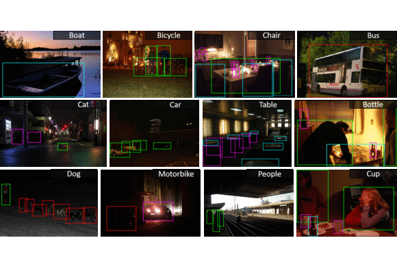

# Bounding Box & Class Type annotation embedder algorithm for the ExDark Dataset
This algorithm embeds all of ExDark's groundtruth information from the text files, into all of ExDark's images.<br/>
The algorithm draws the bounding boxes and prints the class type on the top left of the drawn bounding box.<br/>


## Preferred Directory Path
1. Project Directory
   - CreateGroundtruth
   - ExDark
     - Groundtruth
     - Dataset

## Execute/Run
```
pip install -r requirements.txt
python SetAnnotations.py
```
## Output
Groundtruth images will be generated in the folder "Groundtruth_Images". <br/>
Estimated result will be approximately 1.4GB-1.8GB.<br/>
Recommended minimum disk space 4GB.<br/>

### BiTeX citations:

```
@article{Exdark,
  title={Getting to Know Low-light Images with The Exclusively Dark Dataset},
  author={Loh, Yuen Peng and Chan, Chee Seng},
  journal={Computer Vision and Image Understanding},
  volume={178},
  pages={30-42},
  year={2019},
  doi={https://doi.org/10.1016/j.cviu.2018.10.010}
}
```
### Cite this repository
```
@misc{MyAnnotationEmbedder,
    title = {\href{https://github.com/ChilledFerrum/Python/tree/main/CreateGroundtruth}{Bounding Box \& Class Type annotation embedder algorithm for the ExDark Dataset}},
    author = {Mpouziotas Dimitrios},
    year = {2022},
    month = {June}
}
```
